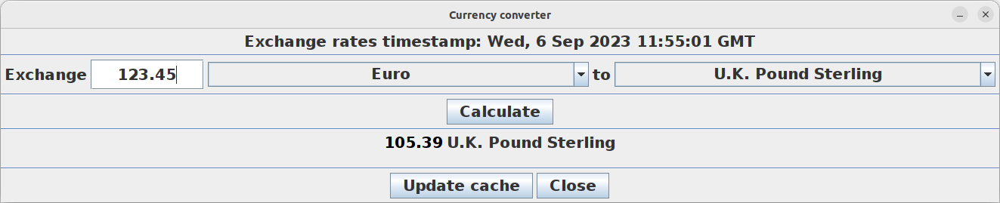

# Currency converter server

This repository contains the server part of my currency converter, written in C++20.

**Linux executable scripts are provided.**

Source code for the client is available in:

https://github.com/adam-choragwicki/CurrencyConverter_Client_JavaSwing

# How it works

Client sends requests to server using **Java sockets API**. Server sends responses to the requests using
**C++ sockets API**.

The converter supports about 150 currencies used around the world. Their list can be found in **data/currencies_list.json** file.

# Exchange rates

Immediately after start, the program uses cached exchange rates downloaded from www.floatrates.com, but the exchange rates can be updated by
clicking "Update cache" button on client GUI. With good internet connection this process takes about 10 seconds. Please note that after updating,
exchange rates for some less popular currencies are not available, because for some reason they are not always listed on www.floatrates.com.

# Components

The currency converter consists of server and client.

**Server** (C++), run as Linux executable

**Client** (Java Swing), run directly using JAR file

# Tests

* Unit tests (Google Test)
* Functional tests (Python)

# 3rd party libraries

**Curl** https://github.com/curl/curl

**RapidJSON** https://github.com/Tencent/rapidjson

**spdlog** https://github.com/gabime/spdlog

# Prerequisites

* Java RE (minimum version 8)

# How to run (Linux only)
1. Clone repository and run **start_currency_converter.sh**

**OR**

1. Download server release zip from:\
   https://github.com/adam-choragwicki/CurrencyConverter_Server_Cplusplus/releases/latest/download/executable_linux.zip
2. Download client release zip from:\
   https://github.com/adam-choragwicki/CurrencyConverter_Client_JavaSwing/releases/latest/download/release.zip
3. Unzip both archives
4. Run **executable_linux/start_currency_converter_server.sh**
5. Run **release/start_currency_converter_client.sh**
