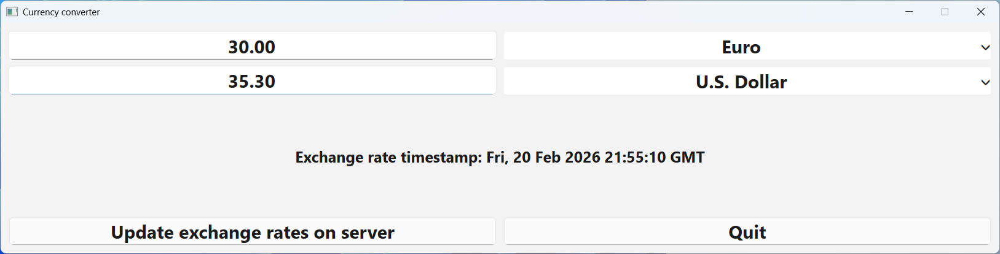

# Currency converter server

This repository contains the server part of my currency converter, written in C++20.

**Windows executable is provided.**

Source code for the client is available in:

https://github.com/adam-choragwicki/CurrencyConverter_Client_Qt_Cplusplus

# How it works

Client communicates with the server via a small REST API over HTTP.

The server exposes endpoints like `/status`, `/config`, `/calculate`, `/update`, and `/update/progress`.

The converter supports about 150 currencies used around the world. Their list can be found in the **data/currencies_names_and_codes.json** file.

# Exchange rates

Immediately after starting, the program uses cached exchange rates downloaded from www.floatrates.com, but the exchange rates can be updated by
clicking the "Update cache" button on the client GUI. With a good internet connection this process takes about 10 seconds. Please note that after updating,
exchange rates for some less popular currencies are not available because for some reason they are not always listed on www.floatrates.com.

# Components

The currency converter consists of server and client.

**Server** (C++), run as a desktop executable

**Client** (Qt C++), run as a desktop executable

# Tests

* Unit tests (Google Test)
* Functional tests (Python)

# 3rd party libraries

- **Curl** https://github.com/curl/curl

- **RapidJSON** https://github.com/Tencent/rapidjson

- **spdlog** https://github.com/gabime/spdlog

# How to run on Windows

1. Download server release zip:  
   https://github.com/adam-choragwicki/CurrencyConverter_Server_Cplusplus/releases/latest/download/CurrencyConverterServer.zip
2. Download client release zip:  
   https://github.com/adam-choragwicki/CurrencyConverter_Client_Qt_Cplusplus/releases/latest/download/CurrencyConverterClient.zip
3. Unzip both archives (e.g., into `C:\CurrencyConverter\Server` and `C:\CurrencyConverter\Client`).
4. Start the server by running `CurrencyConverterServer.exe` from the **server** folder (do not move it; it needs its local `data/` and `connection.json`).
5. Start the client by running `CurrencyConverterClient.exe` from the **client** folder.
